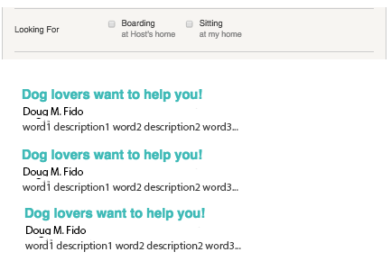

# PetList Test
> These are a few modules of the 'Search Page' on our site.  
To view how the search page acts go to https://dogvacay.com/browse
We will be pseudo implementing some of the modules.

Write your JavaScript using the [Backbone](http://backbonejs.org/) Framework.  
You can write it in ES5 or ES6, whichever you feel more comfortable with. (There is no need to go out of your comfort zone, just try to write good clean code.)  
Don't worry about the `Test` files, those are only there to make sure the base of the project works, and nothing to do with the code you will be writing.  
You should spend only a few hours on this, and no more than about 4 hours. Don't take this is as a hard deadline, its more of a suggestion on our part. If you need a little extra time take it, but don't feel you need to spend several days on this.  

## Goals

We are trying to get a sense of your day to day skills, and ability to write production ready code.
Treat this as a small project you would be assigned and need to complete for an actual job.

We will examine how you approach and solve the problem and
how you organize your code.
While coding, realize that this code needs to be maintained by other members of your team.

## Data Endpoints

The endpoints below will return the exact same data payload as shown below. We just want you to interact with the different endpoints.
So the response that is returned by `http://localhost:3000/static/search.json` will be the same as `
http://localhost:3000/static/search.json?service=boarding` and `
http://localhost:3000/static/search.json?service=sitting`

### Payload
```json
{
  "search" : [
    {
      "title": "title 1",
      "description": "word1 description1 word2 description2 word3 description3 word4 description4",
      "user": {
        "first": "doug",
        "last": "mc dougal"
      },
      "pet": {
        "id": 1,
        "name": "fido",
        "type": "dog"
      }      
    },
    {
      "title": " yippie skippy doggie  day-daycare",
      "desciption": "description description",
      "user": {
        "first": "george",
        "last": "lucus"
      },
      "pet": {
        "id": 2,
        "name": "kitty",
        "type": "cat"
      }
    },
    {
      "title": "my doggie's play pen",
      "desciption": "memememem mememmememeem memememe mememememememe mememem",
      "user": {
        "first": "luke",
        "last": "skywalker"
      },
      "pet": {
        "id": 3,
        "name": "ribbet",
        "type": "frog"
      }
    }
  ]
}
```

### Individual Endpoints

```
  http://localhost:3000/static/search.json
  http://localhost:3000/static/search.json?service=boarding
  http://localhost:3000/static/search.json?service=sitting
```

## User Stories

__GIVEN__: A user comes to a search page  
__WHEN__: The user views the page  
__THEN__: They will see the results from the `/static/search.json` above with the following fields:   

* Title
* Url
* First Name with Last Initial
* Pet Name
* Description


These are the rules for each field:
* Url
 * dashes for spaces
 * Only alpha numeric characters, underscore and dashes
 * no double dashses
 * i.e:
    * one two three => one-two-three
    * one two  three => one-two-three
    * one--two-three => one-two-three
* First Name with Last Initial
  * Capitalize the first character of the first name and last name
  * i.e.
    * seth broomer => Seth B.
* Description
  * At 48 characters and above we want to show ellipses
  * If the 48th character is in the middle of a word then we want to not show that word.
  * ie:
    * word1 description1 word2 description2 word3 description3 word4 description4 => word1 description1 word2 description2 word3...    

Use http://localhost:3000/static/search.json API  

__GIVEN__: A user comes to a search page  
__WHEN__: The user clicks on the boarding filter  
__THEN__: Then they will see the results from the search.json  with the service=boarding specified.  
Use http://localhost:3000/static/search.json?service=boarding API  

__GIVEN__: A user comes to a search page  
__WHEN__: The user clicks on the sitting filter  
__THEN__: Then they will see the results from the search.json  with the service=sitting specified.  
Use http://localhost:3000/static/search.json?service=sitting API  


### Example page


## Installing

You will need [Node](https://nodejs.org/en/) installed on your machine. Once installed in your terminal, `cd` to the project directory and run `npm install`.

Once your dependencies are installed, you can run the command `npm run dev`. And you are ready to start coding.

## Help
Do whatever you feel you need to get this done or finished.
(Feel free to google if you need to!) But if you have any questions about the test itself or what
you need to do feel free to email Seth Broomer <seth@dogvacay.com>.

## Submission
Feel free to create a github repository and send us the link (encouraged!) or if you're more comfortable,
feel free to just send us a zip file with your code included.
